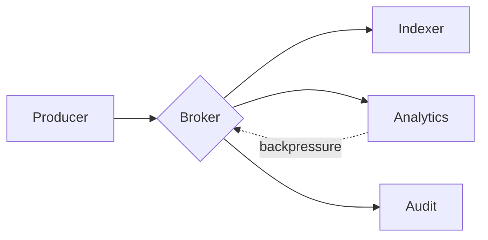
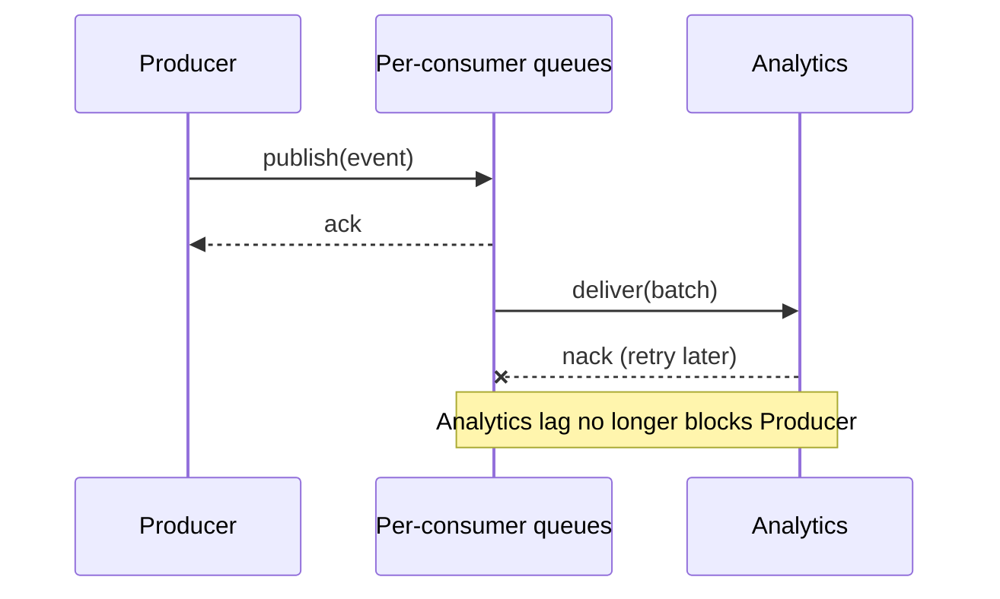

# Ingest Pipeline Redesign

We currently fan out every inbound event to all three consumers, which means a
slow consumer applies backpressure to the whole pipeline. This document proposes
a per-consumer queue instead.

## Current shape



The dotted edge is the problem: `Analytics` is the slowest consumer and its lag
propagates upstream.

## Proposed shape



### Cost

| Component | Today | Proposed |
|-----------|-------|----------|
| Brokers   | 3     | 3        |
| Queues    | 1     | 3        |
| Cost/mo   | $420  | $560     |

The extra $140/mo buys isolation between consumers.

## Rollout

1. Add the new queues alongside the existing topic.
2. Dual-write for one week.
3. Cut over consumers one at a time.
4. Delete the shared topic.

> We should not cut over Audit until the compliance review lands.

```go
func publish(ctx context.Context, e Event) error {
	for _, q := range queuesFor(e) {
		if err := q.Put(ctx, e); err != nil {
			return fmt.Errorf("put %s: %w", q.Name(), err)
		}
	}
	return nil
}
```

---

Open question: do we need ordering guarantees per consumer, or only per key?
